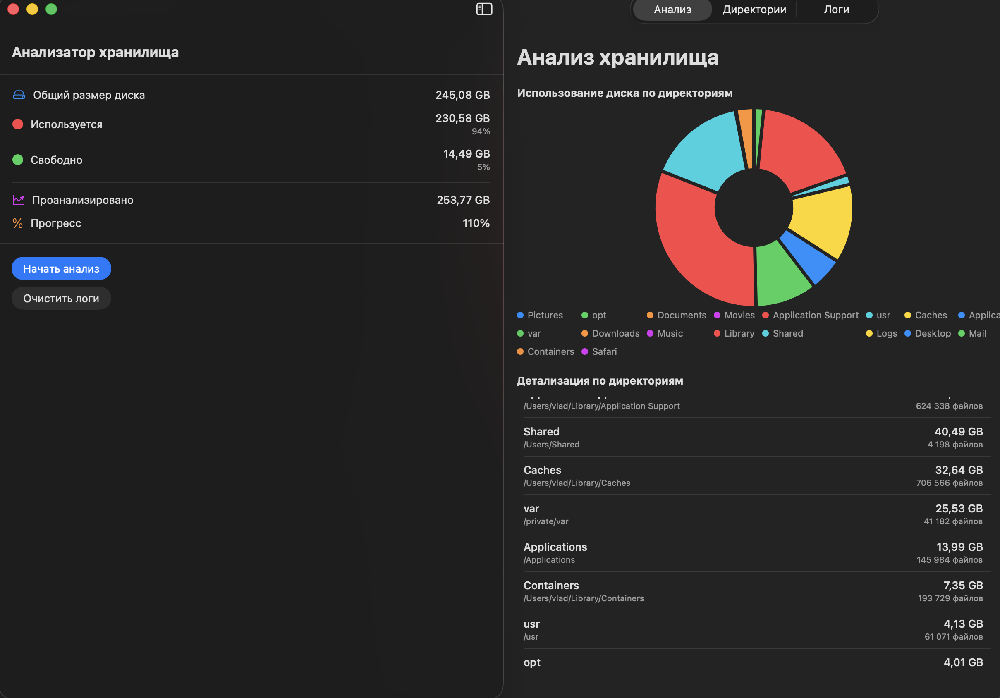
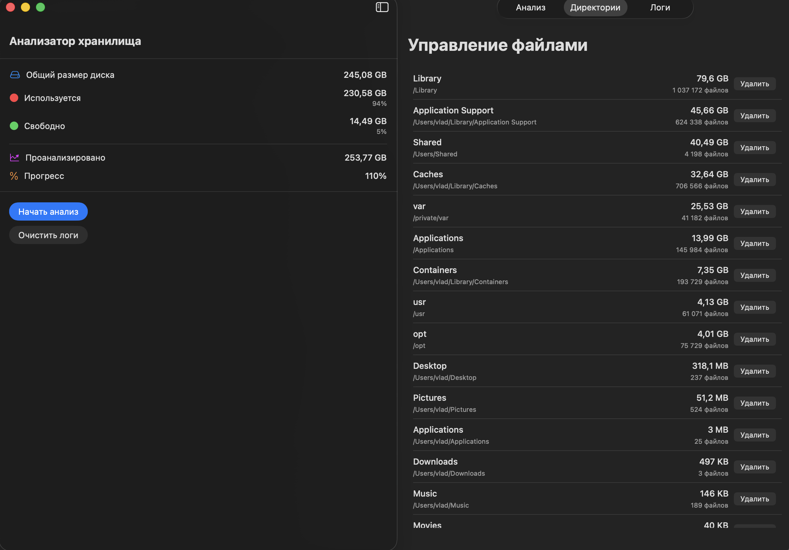
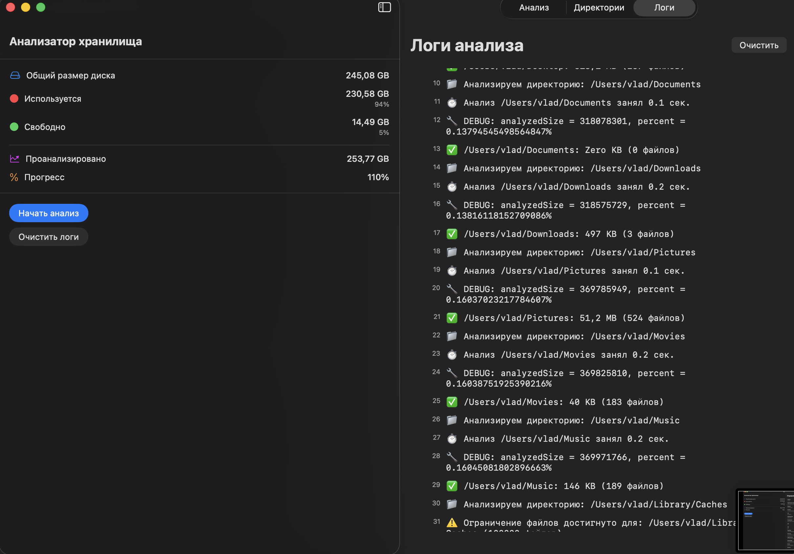

# MacStorageCleaner 🧹

Intelligent macOS application for analyzing disk storage with AI-powered cleanup recommendations, support for external volumes, and deep system analysis.


## ✨ Features

### Core Analysis
- 📊 **Real-time Progress Tracking** - Watch your disk analysis progress in real-time with percentage updates
- 💾 **Disk Usage Statistics** - See total, used, and free space at a glance
- 🎯 **Smart Analysis** - Deep analysis for user directories (4 levels) and shallow analysis for system directories (1 level)
- 📈 **Interactive Charts** - Beautiful pie charts showing directory size distribution
- ⚡ **Memory Efficient** - Batch processing with async/await for smooth performance
- 🛡️ **Safe & Reliable** - Timeout mechanisms prevent hanging on large directories

### Intelligent Cleanup 🤖
- 🗑️ **Deleted Apps Detection** - Automatically finds leftover data from uninstalled applications
- ⏰ **Old Files Analysis** - Identifies files and folders not accessed in over 1 year
- 🔍 **Deep System Analysis** - Detailed recommendations for Library, Caches, Logs, Application Support
- 🎨 **Visual Indicators** - Color-coded risk levels (Safe, Low, Medium, High, Critical)
- 📋 **Smart Recommendations** - Context-aware cleanup suggestions with safety information

### Volume Support 💿
- 🔌 **External Drive Analysis** - Scan and analyze all mounted volumes (USB, external HDDs, network drives)
- 📊 **Volume Statistics** - Storage usage with color-coded indicators
- 🔄 **Same Intelligence** - Apply same cleanup logic to external volumes as main disk
- 🎯 **Per-Volume Analysis** - Detailed breakdown for each connected volume

### Advanced Features
- 📝 **Detailed Logging** - Track analysis progress with file counts and sizes
- 🎨 **Modern UI** - Clean SwiftUI interface with dark mode support
- 🚀 **5 Specialized Tabs** - Analysis, Cleanup, Directories, Logs, Volumes
- 🔐 **Safe Operations** - All recommendations marked with impact levels

## 🖼️ Screenshots

### Main Analysis View
The main interface shows disk usage statistics, analysis progress, and interactive controls.



*Features sidebar with disk statistics, real-time progress bar, and control buttons*

### Analysis Results
View detailed breakdown of directory sizes with interactive pie chart visualization.



*Interactive pie chart showing directory size distribution and detailed file counts*

### Live Logging
Monitor the analysis process in real-time with detailed logs.



*Real-time logging shows current directory being analyzed, file counts, and any warnings*

## 🚀 Getting Started

### Requirements

- macOS 13.0 or later
- Xcode 15.0 or later
- Swift 5.9 or later

### Installation

1. Clone the repository:
```bash
git clone https://github.com/vkhv/MacStorageCleaner.git
cd MacStorageCleaner
```

2. Open the project in Xcode:
```bash
open MacStorageCleaner.xcodeproj
```

3. Build and run the project:
   - Press `Cmd + R` or click the Run button in Xcode
   - The app will request necessary permissions to access your files

### Building from Source

```bash
xcodebuild -project MacStorageCleaner.xcodeproj \
           -scheme MacStorageCleaner \
           -configuration Release \
           build
```

The compiled app will be located in:
```
~/Library/Developer/Xcode/DerivedData/MacStorageCleaner-.../Build/Products/Release/
```

## 🎯 How It Works

### Main Disk Analysis

1. **Disk Info Retrieval** - Gets total, used, and free space from the file system
2. **Directory Scanning** - Analyzes specified directories with configurable depth
3. **Batch Processing** - Processes files in batches (100 files per batch) for memory efficiency
4. **Progress Updates** - Updates UI after each batch with size and percentage
5. **Timeout Protection** - Applies timeouts (60s for system, 120s for user directories)

### Intelligent Cleanup Analysis

1. **App Detection** - Scans `/Applications` for installed apps and their bundle IDs
2. **Orphan Data Discovery** - Compares Application Support/Containers with installed apps
3. **Age Analysis** - Checks file modification dates to find old files (>1 year)
4. **Risk Assessment** - Assigns safety levels: Safe, Low, Medium, High, Critical
5. **Smart Recommendations** - Generates context-aware cleanup suggestions with descriptions

### Volume Analysis

1. **Volume Detection** - Scans mounted volumes using `FileManager.mountedVolumeURLs`
2. **Volume Statistics** - Retrieves total, used, and free space for each volume
3. **Directory Analysis** - Analyzes key directories on external volumes:
   - `/Volumes/{Name}/Library`
   - `/Volumes/{Name}/Applications`
   - `/Volumes/{Name}/Documents`, etc.
4. **Same Intelligence** - Applies all cleanup logic (old files, deleted apps) to volumes

### Analyzed Directories

**User Directories (Deep Analysis - 4 levels):**
- Desktop, Documents, Downloads
- Pictures, Movies, Music
- Library/Caches, Library/Application Support, Library/Logs
- Library/Containers, Library/Safari, Library/Mail
- Applications

**System Directories (Shallow Analysis - 1 level):**
- /Applications
- /Library
- /usr, /opt
- /private/var
- /Users/Shared

## 💡 Technical Highlights

### Performance Optimizations

- **Async/await** - Modern Swift concurrency for non-blocking operations
- **Task.yield()** - Prevents UI freezing during heavy processing
- **Batch Processing** - Limits memory usage with configurable batch sizes
- **Smart Limits** - Different scan limits for system (10K files) vs user directories (100K files)
- **Combine Framework** - Reactive state updates for real-time UI synchronization

### Architecture

```
MacStorageCleaner/
├── MacStorageCleaner/
│   ├── StorageAnalyzer.swift       # Core analysis engine with volume support
│   ├── StorageModel.swift          # Data models (DirectoryInfo, VolumeInfo, State)
│   ├── ContentView.swift           # Main UI (5 tabs: Analysis, Cleanup, Dirs, Logs, Volumes)
│   ├── CleanupView.swift           # Cleanup recommendations with detailed analysis
│   ├── SystemAnalysisView.swift   # Deep system folder analysis view
│   ├── CleanupRecommendations.swift # Cleanup logic and recommendations
│   ├── MacStorageCleanerApp.swift  # App entry point
│   └── Assets.xcassets/            # App icons and resources
├── SystemFolderAnalyzer.swift      # Advanced system analysis with old files detection
└── README.md
```

### Key Components

- **StorageAnalyzer** - Main analysis engine with timeout handling and volume detection
- **SystemFolderAnalyzer** - Deep analysis for system folders (Caches, Logs, Application Support, Containers)
  - Old files detection (>1 year)
  - Deleted apps detection
  - Smart recommendations with impact levels
- **StorageAnalysisState** - Observable state with @Published properties for volumes and directories
- **DirectoryInfo** - Recursive directory structure with size calculations
- **VolumeInfo** - External volume metadata with storage statistics
- **CleanupRecommendation** - Intelligent cleanup suggestions with risk assessment

## 📖 Usage Guide

### Basic Workflow

1. **Start Analysis** - Click "Начать анализ" to scan your main disk
2. **View Results** - Switch between tabs to see different views:
   - **Анализ** - Charts and statistics
   - **Очистка** - Top 10 largest directories with recommendations
   - **Директории** - All analyzed directories with delete options
   - **Логи** - Real-time analysis logs
   - **Тома** - External volumes analysis

### Cleanup Recommendations

1. Navigate to **Очистка** tab
2. Expand any directory to see details
3. Click **"Детальный анализ"** for deep system analysis
4. Look for visual indicators:
   - 🗑️ - Data from deleted apps (safe to remove)
   - ⏰ - Old files (>1 year, consider removing)
   - ⏰⏰ - Very old files (>1 month for logs)
5. Review recommendations with color-coded risk levels
6. Use **"Открыть в Finder"** to verify before deleting

### Volume Analysis

1. Navigate to **Тома** tab
2. Click **"Сканировать тома"** to detect mounted volumes
3. For each volume, click **"Анализировать"**
4. Click **"Детали"** to see directory breakdown
5. Select any directory for detailed analysis with cleanup suggestions

### Safety Features

- **Risk Levels**:
  - 🟢 Safe - Can be deleted without issues
  - 🔵 Low - Minimal risk, check description
  - 🟡 Medium - Review before deleting
  - 🟠 High - Important data, verify carefully
  - 🔴 Critical - System files, DO NOT DELETE

## 🔧 Configuration

Adjust analysis parameters in `StorageAnalyzer.swift`:

```swift
private let maxDepth = 4        // Maximum recursion depth
private let batchSize = 100     // Files per batch
private let maxLogs = 300       // Maximum log entries
```

Timeout settings:
```swift
let timeout: UInt64 = isSystemDir ? 60_000_000_000 : 120_000_000_000
```

## 📊 Performance

- **Memory Usage** - ~200-300 MB during analysis
- **Analysis Speed** - ~10-15 GB/minute on SSD
- **UI Responsiveness** - Smooth updates with <16ms frame time

## 🛠️ Development

### Running Tests

```bash
xcodebuild test -project MacStorageCleaner.xcodeproj \
                -scheme MacStorageCleaner \
                -destination 'platform=macOS'
```

### Debug Mode

Enable verbose logging by uncommenting debug statements in `StorageAnalyzer.swift`:

```swift
analysisState.addLog("🔧 DEBUG: analyzedSize = \(analysisState.analyzedSize)")
```

## 🐛 Known Limitations

- Some system directories may require additional permissions
- Very large directories (>1M files) may trigger timeouts
- Progress calculation is based on used space, not total files
- Deleted app detection relies on app name matching (may have false positives/negatives)
- Network volumes may be slower to analyze

## 🆕 Recent Updates

### Version 2.0 - Intelligent Cleanup & Volume Support

- ✨ Added intelligent cleanup recommendations with deleted app detection
- ⏰ Old files detection (>1 year for data, >7 days for logs)
- 💿 Full support for external volumes and network drives
- 🔍 Deep system folder analysis (Library, Caches, Logs, Application Support, Containers)
- 🎨 Visual indicators for file age and deletion safety (🗑️, ⏰)
- 📊 Detailed analysis view with breakdown by category
- 🔐 Risk-based recommendations with 5 safety levels
- 🚀 5-tab interface for better organization

## 🤝 Contributing

Contributions are welcome! Please feel free to submit a Pull Request.

1. Fork the repository
2. Create your feature branch (`git checkout -b feature/AmazingFeature`)
3. Commit your changes (`git commit -m 'Add some AmazingFeature'`)
4. Push to the branch (`git push origin feature/AmazingFeature`)
5. Open a Pull Request

## 📝 License

This project is licensed under the MIT License - see the [LICENSE](LICENSE) file for details.

## 🙏 Acknowledgments

- Built with [SwiftUI](https://developer.apple.com/xcode/swiftui/)
- Uses Swift's modern concurrency features
- Inspired by disk analysis tools like DaisyDisk and GrandPerspective

## 📧 Contact

- GitHub: [@vkhv](https://github.com/vkhv)
- Repository: [MacStorageCleaner](https://github.com/vkhv/MacStorageCleaner)

---

**Made with ❤️ for macOS**


